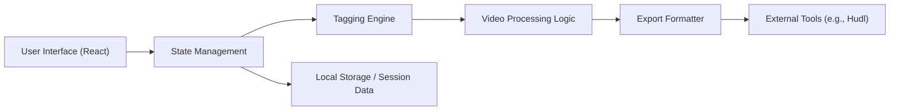

# Ingrid Santos

Software Engineer building scalable systems, with strong expertise in frontend architecture and growing focus on backend and system design.

---

## 🧭 About Me

I design and build applications with a focus on **scalability, maintainability, and developer experience**.

While my core strength is frontend engineering, I actively work across the stack to better understand how systems behave end-to-end — from UI to APIs and infrastructure.

> **Currently focused on:** architecting scalable frontend systems (React + TypeScript), expanding backend knowledge, and strengthening end-to-end thinking.

---

## 🛠️ Technical Expertise

### Frontend Architecture

<table><tr><td valign="top">
  
</td><td valign="top">

- Scalable and modular project structures
- Design systems
- State management and API integration strategies

</td></tr></table>

### Backend & Tools

<table><tr><td valign="top">
  
</td><td valign="top">

- REST API design and integration
- Authentication & authorization flows
- Data modeling fundamentals

</td></tr></table>

### Engineering Practices

<table><tr><td valign="top">
  
</td><td valign="top">

- CI/CD pipelines
- Code reviews and collaboration
- Advanced Git workflows
- Debugging and production issue analysis

</td></tr></table>

---

## 📌 Featured Work

### 🏈 Flag Football Analyzer

🔗 [flag-football-analyzer.vercel.app](https://flag-football-analyzer.vercel.app/)

A tool designed to simplify video cutting and play tagging workflows for game analysis.

**What makes it interesting:**

- Designed a tagging system compatible with external platforms (Hudl-style workflows)
- Focused on reducing manual effort and improving usability
- Built with performance and real-world usage in mind

#### 🏗️ Architecture Overview

**Key ideas behind the design:**

- Separation between UI, tagging logic, and export layer
- Flexible tagging structure to support external integrations
- Local-first approach for fast interaction and responsiveness

**Trade-offs considered:**

- Simplicity vs flexibility in tagging structure
- Local processing vs backend support
- Performance vs feature richness

### [Twitter Bot](https://github.com/ingridl-santos/twitter-bot)

A Python + Tweepy bot that automates content curation by reposting tweets based on specific subjects or hashtags.

### [SaintFlix](https://saintflix.vercel.app/)

A Netflix clone built with React during #ImersãoReact by [Alura Cursos](https://www.alura.com.br).

---

## 🧠 How I Think

- I build systems, not just features — thinking about data flow, trade-offs, and structure from the start
- I optimize for clarity and long-term maintainability over short-term convenience
- I think across boundaries (frontend ↔ backend) and care about reducing complexity for developers

---

## ☕ Dev Feed

---

## 📫 Connect

<table border="0" cellspacing="0" cellpadding="8"><tr><td></td><td></td><td></td></tr></table>

---

*This README was generated with ❤️ by Ingrid Santos.*
